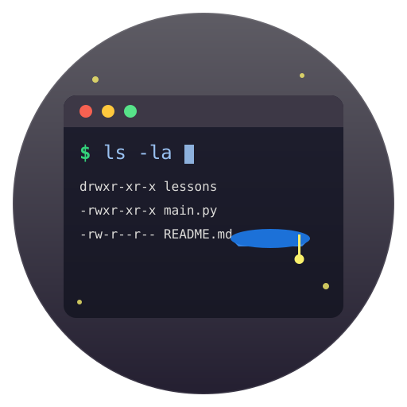

# Terminal Fun 

A beautiful GTK4 application for learning Linux command line basics. Terminal Fun provides an interactive, beginner-friendly way to master essential terminal skills with an embedded terminal and 23 comprehensive structured lessons.

## Features

- 🎓 **Beginner-Friendly**: Assumes no prior Linux/terminal experience
- 📚 **Structured Lessons**: 23 lessons organized into 9 pedagogical categories
- ✅ **Progress Tracking**: Visual checkmarks show completed lessons at a glance
- 🎮 **Interactive Learning**: Learn by doing with hands-on exercises
- 🖥️ **GTK4 GUI**: Beautiful native GNOME application with Adwaita styling
- 🔧 **Embedded Terminal**: Full VTE terminal emulator with Ubuntu theme built right into the app
- 📝 **Markdown-Based Content**: Lesson materials stored in easy-to-edit markdown files
- 🔒 **Safe Learning Environment**: Isolated virtual home directory for risk-free experimentation

## Installation

### From Snap Store (Recommended)

The easiest way to install Terminal Fun is via the Snap Store:

```bash
sudo snap install terminal-fun
```

### System Requirements for Development

If you want to run from source, you'll need GTK4, Adwaita, and VTE development libraries:

#### Fedora/RHEL
```bash
sudo dnf install gtk4-devel libadwaita-devel vte291-devel python3-gobject python3-pyyaml
```

#### Debian/Ubuntu
```bash
sudo apt install libgtk-4-dev libadwaita-1-dev libvte-2.91-dev python3-gi python3-gi-cairo python3-cairo gir1.2-gtk-4.0 gir1.2-adw-1 gir1.2-vte-3.91 python3-yaml
```

#### Arch Linux
```bash
sudo pacman -S gtk4 libadwaita vte3 python-gobject python-yaml
```

### Running from Source

1. Clone this repository:
```bash
git clone https://github.com/kenvandine/terminal-fun
cd terminal-fun
```

2. Install Python dependencies:
```bash
pip install -r requirements.txt
```

3. Run the application:
```bash
python3 main.py
```

Or make it executable:
```bash
chmod +x main.py
./main.py
```

## Usage

When you start Terminal Fun, you'll see:

1. **Main Window**: Split into two resizable panes
   - Left: Lesson index or current lesson content with instructions
   - Right: Embedded terminal for running commands in an isolated environment

2. **Navigation**:
   - Click "View Lessons" to see the lesson index with all categories
   - Completed lessons show a checkmark (✓) for easy progress tracking
   - Use "Previous" and "Next" buttons to move between lessons

3. **Practice**:
   - Read the lesson instructions on the left
   - Type commands in the embedded terminal on the right
   - The terminal uses an isolated virtual home directory - experiment safely!
   - Copy text with `Ctrl+Shift+C`, paste with `Ctrl+Shift+V`

## Curriculum

Terminal Fun provides a complete learning path from beginner to advanced, with **23 comprehensive lessons** organized into **9 categories**:

### 1. Intro
- **Getting Started with the Terminal**: Learn the basics of opening and using the terminal

### 2. Shell Basics
- **Environment Variables**: Learn about environment variables and how they control shell behavior
- **Command History**: Master command history to work faster and smarter in the terminal
- **Aliases and Shell Configuration**: Customize your shell with aliases and configuration files

### 3. Navigation
- **Changing Directories with cd**: Learn how to navigate between folders using the cd command
- **Creating Directories with mkdir**: Learn how to create new folders using mkdir
- **Listing Files with Advanced Options**: Learn advanced ls options to view files in different ways

### 4. Files
- **Creating and Editing Files**: Learn to create files with touch, echo, and basic text editors
- **Copying and Moving Files**: Master cp and mv commands for file management
- **Deleting Files and Directories**: Learn to safely remove files with rm and rmdir
- **Finding Files**: Search for files using find and locate commands
- **File Permissions**: Understand and manage file permissions with chmod and chown

### 5. Text Editors
- **Vim Basics**: Learn the essential commands for using Vim, the powerful terminal text editor

### 6. Pipes & Redirection
- **Output Redirection**: Learn to redirect command output to files
- **Pipes and Chaining Commands**: Master the pipe operator to chain commands together
- **Input Redirection**: Learn to redirect input from files to commands

### 7. Processes
- **Viewing Processes**: Learn to view and monitor running processes with ps, top, and htop
- **Managing Processes**: Learn to control processes with kill, killall, and signals
- **Process Priority and Nice Values**: Control CPU priority with nice and renice

### 8. System Administration
- **Understanding sudo**: Learn to run commands with administrator privileges
- **Package Management with apt**: Learn to install and manage software with apt on Debian/Ubuntu
- **Package Management with snap**: Learn to install software using snap packages

### 9. Version Control
- **Git Basics**: Learn Git from basics to advanced topics for effective version control

## Lesson Structure

Lessons are organized in the `lessons/` directory by category:

```
lessons/
  intro/
    01-getting-started.md
  shell-basics/
    01-environment-variables.md
    02-command-history.md
    03-aliases-config.md
  navigation/
    01-changing-directories.md
    02-creating-directories.md
    03-listing-files-advanced.md
  files/
    01-creating-editing.md
    02-copying-moving.md
    03-deleting.md
    04-finding.md
    05-permissions.md
  text-editors/
    01-vim-basics.md
  pipes-redirection/
    01-output-redirection.md
    02-pipes.md
    03-input-redirection.md
  processes/
    01-viewing-processes.md
    02-managing-processes.md
    03-process-priority.md
  system-admin/
    01-sudo.md
    02-apt.md
    03-snap.md
  version-control/
    01-git-basics.md
```

Each lesson file contains:
- **Frontmatter** (YAML): Metadata like title, description, and order
- **Instructions**: Markdown content explaining the concepts with examples
- **Exercises**: Hands-on practice sections

## Creating Your Own Lessons

To create a new lesson:

1. Create a markdown file in the appropriate category directory (or create a new category)
2. Name it with a number prefix for ordering (e.g., `04-new-topic.md`)
3. Add YAML frontmatter with title, description, and order:

```markdown
---
title: Your Lesson Title
description: Brief description of what this lesson teaches
order: 4
---

## Instructions

Your lesson content here with **bold** and `code` formatting.

### Why This Matters

Explain the practical importance of the topic.

### Basic Commands

Introduce the commands:

```bash
command-example --option argument
```

### Common Patterns

Show real-world usage patterns and examples.

## Exercise 1: Practice Task Name

Description of what to do.

**Command:** `command-to-run`

**Verify:**
```yaml
type: command_output
command: verification-command
contains: expected-text
```

## Exercise 2: Another Practice Task

Continue building on concepts...
```

**Tips for writing lessons:**
- Start with clear explanations before diving into commands
- Use concrete examples with real-world context
- Build complexity gradually within each lesson
- Include multiple exercises to reinforce learning
- Reference related commands and concepts when helpful

See existing lessons in `lessons/` directories for comprehensive examples.

## Virtual Environment

Terminal Fun creates an isolated virtual home directory at `~/.local/share/terminal-fun/virtual-home/` where:
- Your $HOME is safely redirected during lessons
- Pre-configured with `.vimrc` (syntax highlighting for 9+ languages)
- Pre-configured with `.gitconfig` (colors, helpful aliases)
- Contains realistic directory structure (Documents, Downloads, etc.)
- Allows risk-free experimentation without affecting your real files

## Progress Tracking

Your progress is automatically saved to `~/.local/share/terminal-fun/progress.json`. This file tracks:
- Which lessons you've completed (visible as checkmarks in the lesson index)
- Your learning journey through the curriculum

You can safely delete this file to reset your progress and start over.

## Requirements

- Python 3.8+
- PyGObject (for GTK4 bindings)
- PyYAML (for lesson parsing)
- GTK4, Libadwaita, and VTE 3.91 system libraries (see Installation above)

## Development

The application consists of:
- `main.py` - GTK4 application entry point and main window
- `lesson_loader.py` - Loads and parses lesson markdown files
- `progress_tracker.py` - Manages user progress persistence
- `lessons/` - Lesson content directory (23 lessons across 9 categories)
- `snap/` - Snapcraft packaging configuration

## Contributing

Contributions are welcome! Here are ways to help:

- **Add lessons**: Create new lessons following the structure above
- **Improve existing lessons**: Fix typos, clarify explanations, add examples
- **Report issues**: Found a bug? Let us know!
- **Suggest features**: Have ideas for improvements?

The markdown-based lesson format makes it easy to extend the curriculum. Just follow the existing lesson structure and submit a pull request!

## License

This project is licensed under the GNU General Public License v3.0 - see the [LICENSE](LICENSE) file for details.

Terminal Fun is free software: you can redistribute it and/or modify it under the terms of the GNU General Public License as published by the Free Software Foundation, either version 3 of the License, or (at your option) any later version.

This program is distributed in the hope that it will be useful, but WITHOUT ANY WARRANTY; without even the implied warranty of MERCHANTABILITY or FITNESS FOR A PARTICULAR PURPOSE. See the GNU General Public License for more details.

## Acknowledgments

Built with:
- [GTK4](https://www.gtk.org/) - The GNOME toolkit
- [Libadwaita](https://gnome.pages.gitlab.gnome.org/libadwaita/) - GNOME's adaptive UI library
- [VTE](https://gitlab.gnome.org/GNOME/vte) - Virtual Terminal Emulator widget
- [Python](https://www.python.org/) & [PyGObject](https://pygobject.readthedocs.io/)

---

**Ready to become a terminal wizard? Install Terminal Fun and let the adventure begin!** 🚀
